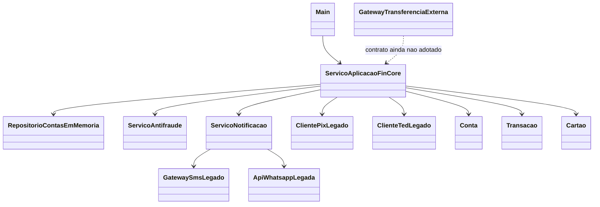

# Diagrama de classes atual

```mermaid
classDiagram
  Main --> ServicoAplicacaoFinCore
  ServicoAplicacaoFinCore --> RepositorioContasEmMemoria
  ServicoAplicacaoFinCore --> ServicoAntifraude
  ServicoAplicacaoFinCore --> ServicoNotificacao
  ServicoAplicacaoFinCore --> ClientePixLegado
  ServicoAplicacaoFinCore --> ClienteTedLegado
  ServicoAplicacaoFinCore --> Conta
  ServicoAplicacaoFinCore --> Transacao
  ServicoAplicacaoFinCore --> Cartao
  ServicoNotificacao --> GatewaySmsLegado
  ServicoNotificacao --> ApiWhatsappLegada
  GatewayTransferenciaExterna ..> ServicoAplicacaoFinCore : contrato ainda nao adotado
```
