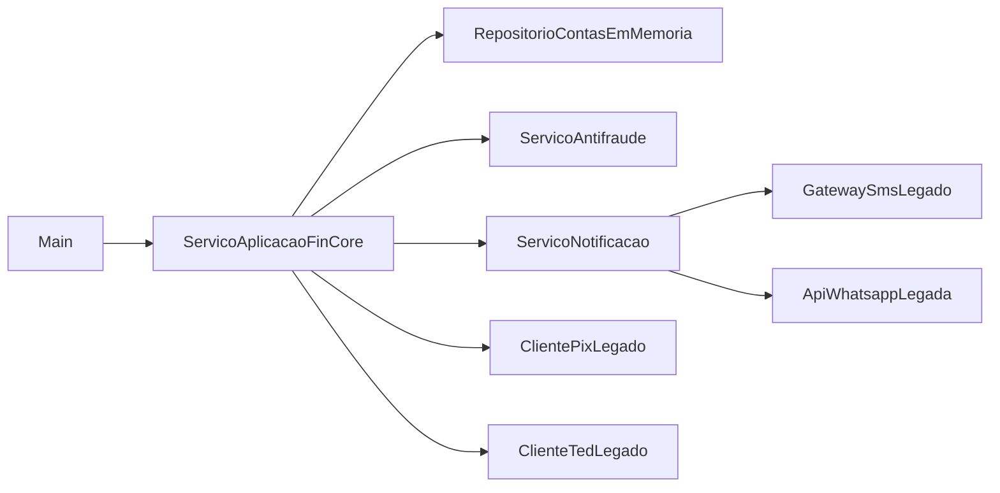

# Diagrama de componentes atual

```mermaid
flowchart LR
  Main --> App[ServicoAplicacaoFinCore]
  App --> Repo[RepositorioContasEmMemoria]
  App --> Fraud[ServicoAntifraude]
  App --> Notify[ServicoNotificacao]
  App --> Pix[ClientePixLegado]
  App --> Ted[ClienteTedLegado]
  Notify --> Sms[GatewaySmsLegado]
  Notify --> Whats[ApiWhatsappLegada]
```

O desenho evidencia o acoplamento direto do serviço de aplicação a várias responsabilidades e integrações.
