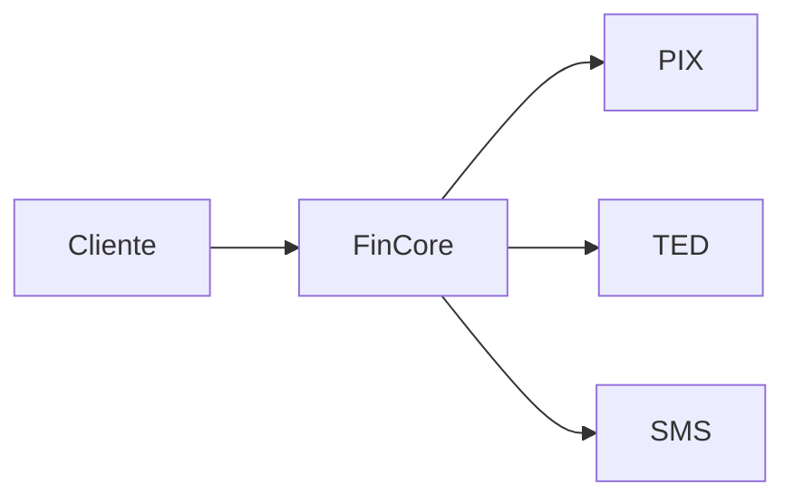

# Diagrama de componentes inicial

Representação do estado descrito na documentação inicial.

```mermaid
flowchart LR
  Cliente --> FinCore
  FinCore --> PIX
  FinCore --> TED
  FinCore --> SMS
```

Use `componentes-atual.md` para representar o código vigente.
