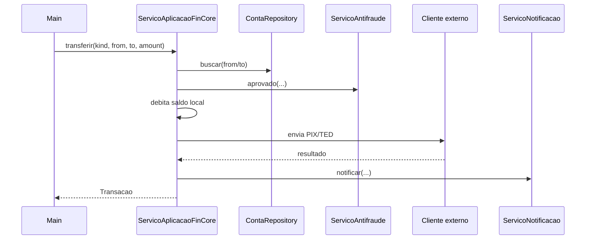

# Sequência atual de transferência

```mermaid
sequenceDiagram
  participant M as Main
  participant A as ServicoAplicacaoFinCore
  participant R as ContaRepository
  participant F as ServicoAntifraude
  participant X as Cliente externo
  participant N as ServicoNotificacao
  M->>A: transferir(kind, from, to, amount)
  A->>R: buscar(from/to)
  A->>F: aprovado(...)
  A->>A: debita saldo local
  A->>X: envia PIX/TED
  X-->>A: resultado
  A->>N: notificar(...)
  A-->>M: Transacao
```

Problema intencional: o débito é feito antes da confirmação externa e não há compensação automática.
